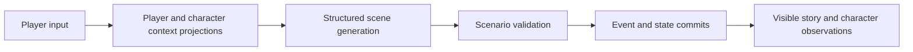

# StoryLoop Harness

An interactive narrative runtime for building stories with persistent world state
and character-specific context. StoryLoop projects the player's and characters'
views into a shared scene-generation request, validates the model's proposals,
and commits events through an injected store.

The player application lives in
[StoryLoop Platform](https://github.com/storyloop0/storyloop-platform). This
library can also be used independently, without the platform's HTTP service,
database, accounts or billing.

**Status:** active incubation, Python 3.12+, MIT. APIs, configuration and saved
formats may change without backward compatibility or migration support.

## What it does

- **Context projection:** assemble role cards, recipient-visible history,
  relevant experiences and worldbook entries within a context budget.
- **Scene generation:** produce narrative, character replies and structured
  action/state proposals through AgentScope-backed model adapters.
- **Controlled commits:** validate proposals against scenario rules, commit
  causal events, and deliver observations and generated speech deterministically.
- **Replay and instrumentation:** replay saved turns, expose committed events
  and model usage, and accept an optional telemetry implementation.



Characters have distinct views and histories. They do not each run a ReAct loop.
The shared model sees several character contexts, so projection is not a hard
information-isolation boundary.

## Quick start: no model key required

Clone this repository and install it in a virtual environment:

```sh
git clone https://github.com/storyloop0/storyloop-harness.git
cd storyloop-harness
python -m venv .venv
# macOS / Linux:
. .venv/bin/activate
# Windows PowerShell: .\.venv\Scripts\Activate.ps1
python -m pip install .
python examples/offline_turn.py
```

Use a Python 3.12+ interpreter for `python`. The example uses a bundled synthetic
scenario, an in-memory store and a deterministic model. It makes no provider
requests and prints the story plus the resulting snapshot version.

### Use the turn API

Run from the repository root after installation:

```python
import asyncio
import sys

from storyloop_harness import ScenarioPackage, TurnEngine, TurnInput
from storyloop_harness.testing import InMemoryGameStore, OfflineModel


async def main():
    package = ScenarioPackage.load("examples/freeform")
    store = InMemoryGameStore()
    package.seed_game(store, "demo")
    engine = TurnEngine(store, package, OfflineModel())
    outcome = await engine.run_turn(
        TurnInput("demo", "Hello", "turn-1", package.version)
    )
    print(outcome.narration)
    print(outcome.snapshot.version)


if __name__ == "__main__":
    sys.stdout.reconfigure(encoding="utf-8")
    asyncio.run(main())
```

To connect a live model, supply a `ModelPort` implementation; the
`generation.CompatibleOpenAIChatModel` adapter uses AgentScope 2.0.9. The caller
supplies credentials and routing. To persist games, implement `GameStore` and
its expected-version commit contract.

## Integration surfaces

| Surface | Purpose |
| --- | --- |
| Top-level package | `ScenarioPackage`, `TurnEngine`, `TurnInput`, `TurnOutcome`, `GameStore`, `ModelPort`, `CampaignContext` |
| `contracts`, `ports` | Turn data and injected model/store/campaign protocols |
| `advanced` | Context projection, event, work and story-clock contracts for integrations |
| `generation` | Structured model transport, formatting and action suggestions |
| `telemetry`, `usage` | Tracing interfaces and scoped token usage, without pricing policy |
| `testing` | In-memory store and deterministic offline model |

`TurnEngine.run_turn` accepts a `TurnInput` plus optional progress and campaign
time bounds. `run_ready_work` drains supported queued work, including previously
generated character speech. `TurnOutcome` contains visible story output, a
snapshot, events committed by that invocation and its model usage.

Keep request ownership, authentication, pricing and settlement in the calling
application. Internal module paths are not extension APIs.

## Current boundaries

- `single_call` is the supported engine: an ordinary turn uses structured scene
  generation followed by deterministic work. Other scheduled generation tasks
  and transport retries can involve additional model requests.
- Old per-NPC ReAct execution is removed. Saves with pending `npc_reply` work
  are rejected before generation or world writes; recreate these saves.
  Current `single_npc_reply` work delivers already generated speech.
- The included store is for examples and tests. Durable persistence and
  cross-process coordination require a store and application implementation.
- Saved-turn replay and expected-version commits do not by themselves provide
  end-to-end billing recovery or distributed execution guarantees.

## Development

```sh
python -m pip install -e '.[test]' build
python -m pytest tests -q
python -m build --wheel
```

The CI workflow also installs a built wheel outside the checkout and runs the
offline example. Tests use deterministic models; they do not establish the
quality of live-model narrative output.

Further work focuses on explainable context selection and budgets, long-session
memory, reproducible quality/cost comparisons, and stronger execution recovery.
These are development directions, not completed guarantees.

## License

[MIT](LICENSE).
